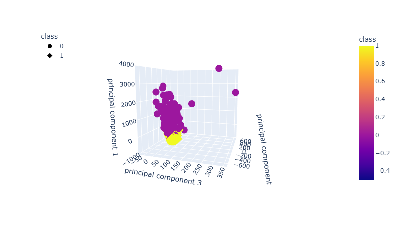
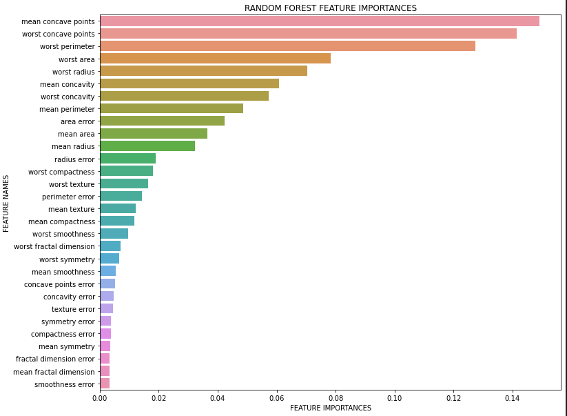

# Breast Cancer - Machine Learning Integration

## Objective
To apply machine learning from an available dataset, and create a model to predict whether breast cell tissue is malignant or benign using set of tools as below.

## Team Members
Charissa Hoxie 
Michael Farm 
Toshi Torihara 
Everett Waterman 

## Tools Used
`Scikit-learn`
`Python Pandas`
`SQL Database`

## Data Source
https://scikit-learn.org/stable/modules/generated/sklearn.datasets.load_breast_cancer.html

## 1. Data Preprocessing
Modified the Original Dataset:

To better transfer to a SQL Database:

## 2. Neural Network Model - Compile, Train, Evaluate, and Optimize
Attempted 3 different models with various configurations of neurons, layers, and activation function

## 3. Principal Component Analysis - Visualization of clusters with KMeans
Applied PCA and spread the dataset into 3 dimensions for cluster visualization

Generated plotly graph of 3 principal components using KMean

## 4. Random Forest Classifier - Feature Importance
Plotted random forest feature importance using Seaborn

